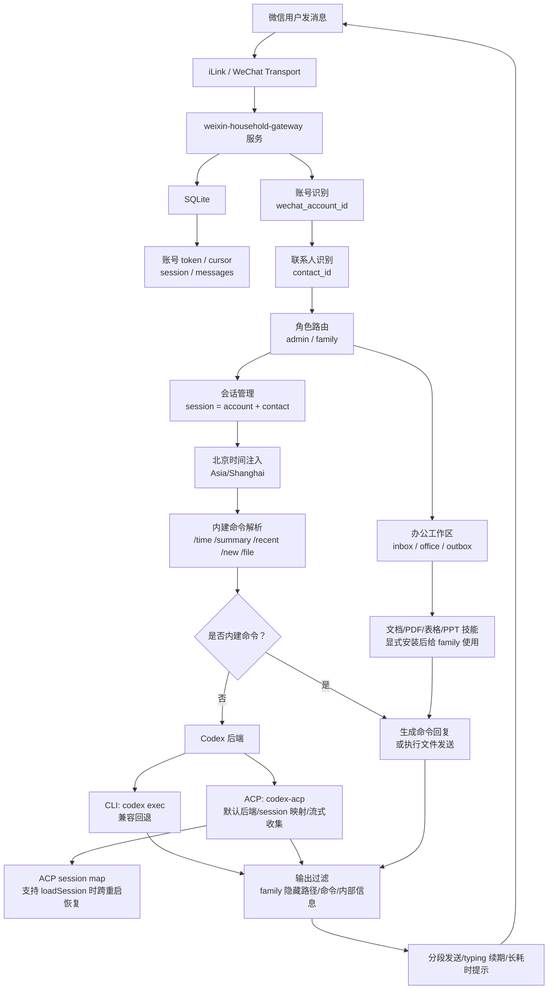

# weixin-household-gateway

家庭共享微信 AI 网关：家里人直接在微信里聊天，你保留 `admin` 高权限身份。服务长期运行在 Linux 服务器上，统一按北京时间理解上下文。

当前产品名已经调整为 `weixin-household-gateway`，但 GitHub 仓库地址暂时仍是：

```text
https://github.com/thekfjie/weixin-household-agent-acp
```

## 部署和使用

### 1. 一键安装

用普通登录用户 SSH 到服务器，不要 `sudo su -`：

```bash
curl -fsSL https://raw.githubusercontent.com/thekfjie/weixin-household-agent-acp/main/infra/scripts/linux/bootstrap.sh | bash
```

脚本会拉代码到 `/opt/weixin-household-gateway`，先检测系统环境；缺少 `git`、`sudo`、`Node.js 22 LTS` 等基础依赖时会询问是否补装。随后安装依赖、构建、写入 `.env` 和 systemd 服务。首次没有微信账号时会停在终端二维码，扫码确认后继续启动。

默认是交互安装，不会一上来就一路自动跑完。  
如果你明确想要无交互默认值安装，才显式加：

```bash
curl -fsSL https://raw.githubusercontent.com/thekfjie/weixin-household-agent-acp/main/infra/scripts/linux/bootstrap.sh | \
BOOTSTRAP_YES=1 \
bash
```

默认值按“你自己的家庭服务器”设计：

- Codex 后端默认走 `ACP`，不是一次性 `codex exec`。
- 服务用户默认是当前 SSH 用户，单人服务器推荐直接用 `ubuntu`。
- admin 默认给 `full` sudo：安装器会写入该服务用户的 `NOPASSWD: ALL`。如果你不想给全权限，安装时传 `PERMISSION_MODE=limited` 或 `PERMISSION_MODE=none`。
- `codex-acp` 安装在项目依赖目录 `node_modules/.bin/codex-acp`，不依赖全局 wrapper。
- 如果没检测到 `codex`，安装器会先询问是否用系统默认方式执行 `npm install -g @openai/codex`。

默认服务用户是当前用户。单人服务器推荐直接用 `ubuntu`，重点是保持一致：

```text
systemd User=ubuntu
HOME=/home/ubuntu
/home/ubuntu/.codex/config.toml
/home/ubuntu/.codex/auth.json
```

不要用 `/usr/local/bin/codex` 这种“表面是 ubuntu，实际 sudo 到 wxbot”的跨用户 wrapper。CLI 和 ACP 必须看到同一个真实用户和同一套 `~/.codex`。

目录边界：

```text
/opt/weixin-household-gateway          项目代码、脚本、dist、node_modules
/var/lib/weixin-household-gateway      SQLite、账号、会话、附件、办公文件
```

不建议把运行数据直接放进 `/opt` 项目目录。这样重装/更新代码时更干净，卸载时也能明确选择“删除程序但保留数据”。如果你想看起来直观，可以在项目目录加一个软链接：

```bash
cd /opt/weixin-household-gateway
ln -s /var/lib/weixin-household-gateway data-live
```

### 2. Codex 准备

默认推荐：`ACP + 第三方 API key`

安装器会在交互过程中默认先让你选择 `api_key` 模式，并直接提示输入：

- `CODEX_CLI_BASE_URL`
- `CODEX_CLI_API_KEY`

如果你当场不想填，它会允许你改走 `login` 模式，不会因为没填就直接退出。

推荐先准备 `.env`：

```env
CODEX_CLI_AUTH_MODE=api_key
CODEX_CLI_BASE_URL=https://你的第三方兼容服务/v1
CODEX_CLI_API_KEY=sk-...
CODEX_CLI_MODEL=gpt-5.4
CODEX_CLI_REVIEW_MODEL=gpt-5.4
CODEX_ADMIN_BACKEND=acp
CODEX_FAMILY_BACKEND=acp
```

如果你想在安装时一次性带上这些值，也可以直接：

```bash
curl -fsSL https://raw.githubusercontent.com/thekfjie/weixin-household-agent-acp/main/infra/scripts/linux/bootstrap.sh | \
CODEX_CLI_AUTH_MODE=api_key \
CODEX_CLI_BASE_URL=https://你的第三方兼容服务/v1 \
CODEX_CLI_API_KEY=sk-... \
CODEX_CLI_MODEL=gpt-5.4 \
CODEX_CLI_REVIEW_MODEL=gpt-5.4 \
USER_MODE=current \
PERMISSION_MODE=full \
LOGIN_ROLE=admin \
bash
```

然后写入 Codex CLI 配置：

```bash
cd /opt/weixin-household-gateway
node dist/apps/server/configure-codex.js --apply
```

这里建议把：

- `CODEX_CLI_MODEL` 当作主要对话模型
- `CODEX_CLI_REVIEW_MODEL` 当作压缩/回顾模型

这样后续做对话压缩和摘要时，不需要临时再问一遍该用哪个模型。

再做一次连通性验证：

```bash
codex exec --skip-git-repo-check "请用一句话回复：Codex 已接通"
node dist/apps/server/doctor.js --acp-session
```

可选模式：官方 `codex login`

```bash
codex login
codex exec --skip-git-repo-check "请用一句话回复：Codex 已接通"
```

`CODEX_*_ACP_AUTH_MODE=auto` 时：有 API key 就优先显式认证；没有 key 才交给 `codex-acp` 读取服务用户自己的官方登录态。

兼容回退：CLI `exec`

- `exec` 路径只作为兼容回退保留，不是默认推荐。
- 它是一条一次性命令执行链路，风险和不稳定性都高于持续 ACP 会话。
- 如果只是跑家庭微信网关，优先用 `ACP`，不要把 `exec` 当默认后端。

### 3. 自检和更新

```bash
cd /opt/weixin-household-gateway
node dist/apps/server/doctor.js
node dist/apps/server/doctor.js --acp-session
```

`codex exec` 成功只代表 CLI 可用；`doctor.js --acp-session` 成功才代表 ACP session 可用。

更新：

```bash
cd /opt/weixin-household-gateway
git pull
corepack pnpm build
sudo systemctl restart weixin-household-gateway
```

### 4. 多微信账号

首次安装扫码账号默认是 `admin`。后续添加家人账号：

```bash
cd /opt/weixin-household-gateway
node dist/apps/server/setup.js family --force
sudo systemctl restart weixin-household-gateway
```

账号管理：

```bash
node dist/apps/server/accounts.js list
node dist/apps/server/accounts.js role <account_id> family
node dist/apps/server/accounts.js role <account_id> admin
node dist/apps/server/accounts.js disable <account_id>
node dist/apps/server/accounts.js enable <account_id>
```

微信内 admin 命令：

```text
/help
/time
/whoami
/mode admin
/mode family
/memory
/last
/yesterday
/summary
/recent
/accounts
/sessions
/files
/file /tmp/test.txt 测试文件
```

admin 也可以说“把 /tmp/test.txt 发给我”。family 不能触发服务器任意路径文件发送。

控制指令说明：

- `/help`：查看当前账号可用命令
- `/time`：查看北京时间
- `/whoami`：查看当前账号默认角色、当前会话模式和会话 ID
- `/mode admin|family`：admin 账号可切换当前会话模式；family 账号不能升到 admin
- `/memory`：查看当前会话已经累计的 memory 信息，例如 turn 数、估算 token、上一段摘要来源
- `/new` 或 `/reset`：重置当前对话上下文
- `/summary`：查看当前会话摘要
- `/recent`：查看当前会话最近几条消息
- `/last`：查看上一段对话
- `/yesterday`：查看昨天的上一段对话
- `/sessions`：admin 查看最近活跃会话
- `/accounts`：admin 查看已绑定微信账号
- `/files`：admin 查看最近可发送文件
- `/file <路径> [说明]`：admin 发送白名单目录内文件

另外，如果用户自然提到“昨天”“上一次”“前面的那个”，系统也会在内部优先附带上一段对话摘要，供模型按需参考，而不是每次都强行重塞整段历史。

`/last` 和 `/yesterday` 当前会优先显示：

- 上一段会话时间
- 已有摘要
- 最近几条消息的短概览

当前会话记忆策略：

- 系统会同时看空闲时长、轮数和估算 token 数，不只看消息轮数。
- 默认阈值是：
  - `SESSION_ROTATE_IDLE_HOURS=24`
  - `SESSION_ROTATE_MAX_TURNS=50`
  - `SESSION_ROTATE_MAX_ESTIMATED_TOKENS=256000`
- 超过阈值后不会直接把整段历史继续硬塞给模型，而是会开启新的一段会话，并把上一段的摘要/最近消息作为 carryover 信息按需参考。
- 跨到新的一天时，系统也会优先开启新段，而不是把昨天和今天长时间混在一个活跃会话里。
- 当前摘要先走轻量确定性策略：优先从上一段最近消息和相关文件里生成短摘要，不额外放大 prompt，也不先依赖模型来生成长摘要。

办公文件建议放在受控工作区：

```text
/var/lib/weixin-household-gateway/inbox   家人发来的文件下载后放这里
/var/lib/weixin-household-gateway/office  文档、表格、PDF、PPT 的处理中间文件
/var/lib/weixin-household-gateway/outbox  准备发回微信的成品文件
```

当前已打通“从白名单工作区发回微信”的发送链路；文件/图片入站会先下载解密到 `inbox`，如果用户只发附件不发说明，服务会先提示“再说一句想怎么处理”，不会立刻让 AI 猜需求。用户下一条文字会带上刚才附件的本地信息一起交给 Codex。

### 5. 备份和卸载

```bash
node dist/apps/server/backup.js
node dist/apps/server/backup.js --restore /path/to/backup-dir --yes
```

备份只复制 `DATA_DIR`，不复制 `.env` 或 `~/.codex` 凭据。

卸载保留数据：

```bash
bash /opt/weixin-household-gateway/infra/scripts/linux/uninstall.sh --yes --keep-data
```

彻底卸载并尽量恢复安装前环境：

```bash
bash /opt/weixin-household-gateway/infra/scripts/linux/uninstall.sh --yes
```

如果你确认要忽略“安装前目录已存在”的保守保护，强制清空应用目录和数据目录：

```bash
bash /opt/weixin-household-gateway/infra/scripts/linux/uninstall.sh --yes --purge-all
```

## 流程图



## Codex 后端

默认推荐 `acp`：

```env
CODEX_ADMIN_BACKEND=acp
CODEX_FAMILY_BACKEND=acp
CODEX_ADMIN_ACP_AUTH_MODE=auto
CODEX_FAMILY_ACP_AUTH_MODE=auto
```

CLI 只作为兼容回退：

```env
CODEX_ADMIN_BACKEND=cli
CODEX_ADMIN_COMMAND=codex
CODEX_ADMIN_ARGS=exec --skip-git-repo-check
```

`CODEX_ADMIN_ACP_COMMAND` 留空时使用项目依赖里的 `node_modules/.bin/codex-acp`。ACP 会按微信会话复用 session；服务重启后，如果 adapter 支持 ACP `session/load`，会加载持久化的 ACP sessionId，否则自动新建。

## 当前能力

- 多微信账号绑定，admin/family 分权
- SQLite 持久化账号、会话、消息、附件
- 会话自动轮转：支持跨天、新段和上一段 carryover
- CLI 和 ACP 两种 Codex 后端
- 默认 ACP 会话映射，CLI 仅作为回退
- 北京时间上下文锚点
- family 输出过滤和最小环境变量
- admin 文件发送：`/file`、自然语言、结构化动作标记
- `inbox/office/outbox` 办公工作区、入站文件/图片下载解密、文件白名单、大小限制、CDN 上传和微信发送
- “正在输入中”续期、长耗时提示、长回复分段
- doctor 自检、数据备份/恢复、卸载恢复安装前环境

## 办公技能

家庭用户只需要看自然回复，不需要看到本地路径和命令。服务端给 family 预留了 `inbox/office/outbox` 三个目录：家人发来的图片和文件会先进入 `inbox`，处理过程放 `office`，成品放 `outbox` 并发回微信。

技能安装不默认从 `skills.sh` 自动拉取。公开技能市场里有文档、PDF、PPT、表格类技能，但来源质量不一，默认让后台服务自动联网安装不适合家庭网关。推荐做法是：只把你明确信任的办公技能安装到 family 使用的 Codex 用户目录，常见类别是 DOCX、PDF、XLSX/CSV、PPTX；安装后用 `doctor.js --acp-session` 验证。

如果你要试一组常见办公技能，可以用可选脚本：

```bash
cd /opt/weixin-household-gateway
bash infra/scripts/linux/install-office-skills.sh
sudo systemctl restart weixin-household-gateway
```

这个脚本会尝试安装 registry 中存在的 `devtools/docx`、`devtools/pdf`、`devtools/xlsx`、`devtools/pptx`，安装目录默认是当前服务用户的 `~/.codex/skills`。

如果你想让办公技能只给 family 用，可以给 family 单独一套 Codex home：

```env
CODEX_FAMILY_HOME=/home/ubuntu/.codex-family
```

然后把官方登录配置或 API key 配置复制/写入这套目录，再用 `CODEX_HOME=/home/ubuntu/.codex-family bash infra/scripts/linux/install-office-skills.sh` 安装办公技能。默认不拆分，是为了避免刚安装时 ACP 因为找不到登录态而失败。

## 用户组提示词

最新提示词整理文档见：[提示词参考](docs/prompts.md)。

README 不再复制整段 prompt，避免和代码漂移。当前真实生效版本、注入顺序、ACP 首轮/后续轮次示例，都以 [提示词参考](docs/prompts.md) 为准。

## 更多文档

- [产品目标核对](docs/product-checklist.md)
- [提示词参考](docs/prompts.md)
- [办公技能和文件工作区](docs/office-skills.md)
- [后续计划](docs/roadmap.md)
- [架构草案](docs/architecture-v0.md)
- [Windows 本地测试](docs/windows-local-test.md)
