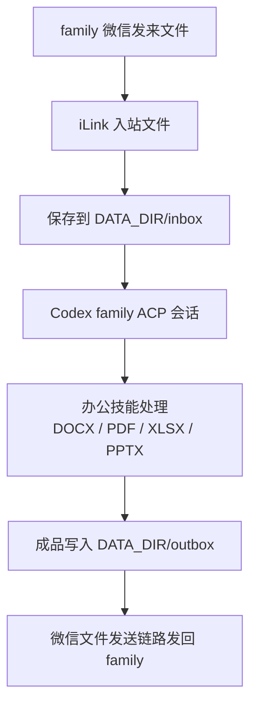

# 办公技能和文件工作区

本文记录家庭用户发来办公文件时的目标流程，以及技能安装边界。

## 目标流程



当前已经完成的是 `outbox` 到微信的发送链路、`inbox/office/outbox` 三个受控目录，以及文件/图片入站下载解密。用户只发附件时不会立刻进入 AI 回复；服务会先保存附件并提醒用户再发一句需求，下一条文字会带上待处理附件一起交给 Codex。

## 目录约定

- `DATA_DIR/inbox`：微信用户发来的原始文件，后续下载成功后落这里。
- `DATA_DIR/office`：处理中间目录，适合放拆包、渲染、临时 markdown、图片预览。
- `DATA_DIR/outbox`：准备发回微信的成品文件。

默认 Linux 安装会把这三个目录加入 `FILE_SEND_ALLOWED_DIRS`。这不是为了让 family 发送服务器任意文件，而是让“处理完成的办公文件”可以从受控目录发回微信。

## 技能策略

默认不从 `skills.sh` 或其他公开市场自动安装技能。原因很简单：技能可能包含脚本、依赖安装、网络访问和文件系统访问，家庭网关长期运行在服务器上，不能把未知来源代码变成默认行为。

推荐的 family 办公技能类别：

- DOCX：创建、编辑、批注、改写 Word 文档。
- PDF：提取文本/表格、拆分合并、表单、水印、生成 PDF。
- XLSX/CSV：表格清洗、公式、图表、数据分析。
- PPTX：读取、改写、生成演示文稿。

安装原则：

- 只安装你明确知道来源的技能。
- 尽量安装到服务用户自己的 Codex 目录，例如 `/home/ubuntu/.codex/skills`。
- family 仍使用最小环境变量和输出过滤；技能可以处理文件，但回复给家人的内容不能暴露内部路径、命令和堆栈。
- 安装后先运行 `node dist/apps/server/doctor.js --acp-session`，再从微信发一个小文件做端到端测试。

可选安装脚本：

```bash
cd /opt/weixin-household-agent-acp
bash infra/scripts/linux/install-office-skills.sh
sudo systemctl restart weixin-household-agent-acp
```

脚本会尝试安装当前 registry 里存在的 `devtools/docx`、`devtools/pdf`、`devtools/xlsx`、`devtools/pptx`。如果某个 slug 不存在会跳过，不影响其他技能。

如果要做到“只给 family 装办公技能”，可以启用独立 Codex home：

```env
CODEX_FAMILY_HOME=/home/ubuntu/.codex-family
```

这套目录里也必须有可用的 `config.toml` 和 `auth.json`，否则 family ACP 会认证失败。准备好后用：

```bash
CODEX_HOME=/home/ubuntu/.codex-family bash infra/scripts/linux/install-office-skills.sh
sudo systemctl restart weixin-household-agent-acp
```

## 后续实现点

- 已完成：iLink 入站文件/图片下载接口。
- 已完成：根据 `media.aes_key`、`image_item.aeskey`、`encrypt_query_param`、`md5`、`len` 校验和解密。
- 已完成：下载成功后在 SQLite `attachments` 中记录本地路径。
- family 触发办公技能处理时，只允许读写该会话自己的 `inbox/office/outbox` 文件。
- 处理完成后调用现有文件发送链路，把 `outbox` 成品发回原微信会话。
