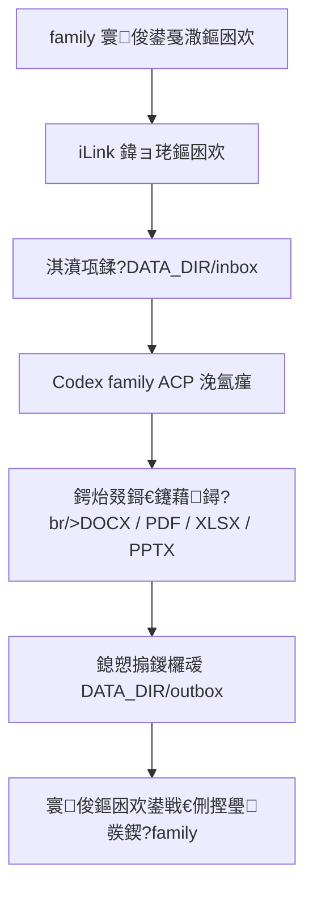

# 鍔炲叕鎶€鑳藉拰鏂囦欢宸ヤ綔鍖?
鏈枃璁板綍瀹跺涵鐢ㄦ埛鍙戞潵鍔炲叕鏂囦欢鏃剁殑鐩爣娴佺▼锛屼互鍙婃妧鑳藉畨瑁呰竟鐣屻€?
## 鐩爣娴佺▼



褰撳墠宸茬粡瀹屾垚鐨勬槸 `outbox` 鍒板井淇＄殑鍙戦€侀摼璺€乣inbox/office/outbox` 涓変釜鍙楁帶鐩綍锛屼互鍙婃枃浠?鍥剧墖鍏ョ珯涓嬭浇瑙ｅ瘑銆傜敤鎴峰彧鍙戦檮浠舵椂涓嶄細绔嬪埢杩涘叆 AI 鍥炲锛涙湇鍔′細鍏堜繚瀛橀檮浠跺苟鎻愰啋鐢ㄦ埛鍐嶅彂涓€鍙ラ渶姹傦紝涓嬩竴鏉℃枃瀛椾細甯︿笂寰呭鐞嗛檮浠朵竴璧蜂氦缁?Codex銆?
## 鐩綍绾﹀畾

- `DATA_DIR/inbox`锛氬井淇＄敤鎴峰彂鏉ョ殑鍘熷鏂囦欢锛屽悗缁笅杞芥垚鍔熷悗钀借繖閲屻€?- `DATA_DIR/office`锛氬鐞嗕腑闂寸洰褰曪紝閫傚悎鏀炬媶鍖呫€佹覆鏌撱€佷复鏃?markdown銆佸浘鐗囬瑙堛€?- `DATA_DIR/outbox`锛氬噯澶囧彂鍥炲井淇＄殑鎴愬搧鏂囦欢銆?
榛樿 Linux 瀹夎浼氭妸杩欎笁涓洰褰曞姞鍏?`FILE_SEND_ALLOWED_DIRS`銆傝繖涓嶆槸涓轰簡璁?family 鍙戦€佹湇鍔″櫒浠绘剰鏂囦欢锛岃€屾槸璁┾€滃鐞嗗畬鎴愮殑鍔炲叕鏂囦欢鈥濆彲浠ヤ粠鍙楁帶鐩綍鍙戝洖寰俊銆?
## 鎶€鑳界瓥鐣?
榛樿涓嶄粠 `skills.sh` 鎴栧叾浠栧叕寮€甯傚満鑷姩瀹夎鎶€鑳姐€傚師鍥犲緢绠€鍗曪細鎶€鑳藉彲鑳藉寘鍚剼鏈€佷緷璧栧畨瑁呫€佺綉缁滆闂拰鏂囦欢绯荤粺璁块棶锛屽搴綉鍏抽暱鏈熻繍琛屽湪鏈嶅姟鍣ㄤ笂锛屼笉鑳芥妸鏈煡鏉ユ簮浠ｇ爜鍙樻垚榛樿琛屼负銆?
鎺ㄨ崘鐨?family 鍔炲叕鎶€鑳界被鍒細

- DOCX锛氬垱寤恒€佺紪杈戙€佹壒娉ㄣ€佹敼鍐?Word 鏂囨。銆?- PDF锛氭彁鍙栨枃鏈?琛ㄦ牸銆佹媶鍒嗗悎骞躲€佽〃鍗曘€佹按鍗般€佺敓鎴?PDF銆?- XLSX/CSV锛氳〃鏍兼竻娲椼€佸叕寮忋€佸浘琛ㄣ€佹暟鎹垎鏋愩€?- PPTX锛氳鍙栥€佹敼鍐欍€佺敓鎴愭紨绀烘枃绋裤€?
瀹夎鍘熷垯锛?
- 鍙畨瑁呬綘鏄庣‘鐭ラ亾鏉ユ簮鐨勬妧鑳姐€?- 灏介噺瀹夎鍒版湇鍔＄敤鎴疯嚜宸辩殑 Codex 鐩綍锛屼緥濡?`/home/ubuntu/.codex/skills`銆?- family 浠嶄娇鐢ㄦ渶灏忕幆澧冨彉閲忓拰杈撳嚭杩囨护锛涙妧鑳藉彲浠ュ鐞嗘枃浠讹紝浣嗗洖澶嶇粰瀹朵汉鐨勫唴瀹逛笉鑳芥毚闇插唴閮ㄨ矾寰勩€佸懡浠ゅ拰鍫嗘爤銆?- 瀹夎鍚庡厛杩愯 `node dist/apps/server/doctor.js --acp-session`锛屽啀浠庡井淇″彂涓€涓皬鏂囦欢鍋氱鍒扮娴嬭瘯銆?
鍙€夊畨瑁呰剼鏈細

```bash
cd /opt/weixin-household-gateway
bash infra/scripts/linux/install-office-skills.sh
sudo systemctl restart weixin-household-gateway
```

鑴氭湰浼氬皾璇曞畨瑁呭綋鍓?registry 閲屽瓨鍦ㄧ殑 `devtools/docx`銆乣devtools/pdf`銆乣devtools/xlsx`銆乣devtools/pptx`銆傚鏋滄煇涓?slug 涓嶅瓨鍦ㄤ細璺宠繃锛屼笉褰卞搷鍏朵粬鎶€鑳姐€?
濡傛灉瑕佸仛鍒扳€滃彧缁?family 瑁呭姙鍏妧鑳解€濓紝鍙互鍚敤鐙珛 Codex home锛?
```env
CODEX_FAMILY_HOME=/home/ubuntu/.codex-family
```

杩欏鐩綍閲屼篃蹇呴』鏈夊彲鐢ㄧ殑 `config.toml` 鍜?`auth.json`锛屽惁鍒?family ACP 浼氳璇佸け璐ャ€傚噯澶囧ソ鍚庣敤锛?
```bash
CODEX_HOME=/home/ubuntu/.codex-family bash infra/scripts/linux/install-office-skills.sh
sudo systemctl restart weixin-household-gateway
```

## 鍚庣画瀹炵幇鐐?
- 宸插畬鎴愶細iLink 鍏ョ珯鏂囦欢/鍥剧墖涓嬭浇鎺ュ彛銆?- 宸插畬鎴愶細鏍规嵁 `media.aes_key`銆乣image_item.aeskey`銆乣encrypt_query_param`銆乣md5`銆乣len` 鏍￠獙鍜岃В瀵嗐€?- 宸插畬鎴愶細涓嬭浇鎴愬姛鍚庡湪 SQLite `attachments` 涓褰曟湰鍦拌矾寰勩€?- family 瑙﹀彂鍔炲叕鎶€鑳藉鐞嗘椂锛屽彧鍏佽璇诲啓璇ヤ細璇濊嚜宸辩殑 `inbox/office/outbox` 鏂囦欢銆?- 澶勭悊瀹屾垚鍚庤皟鐢ㄧ幇鏈夋枃浠跺彂閫侀摼璺紝鎶?`outbox` 鎴愬搧鍙戝洖鍘熷井淇′細璇濄€?